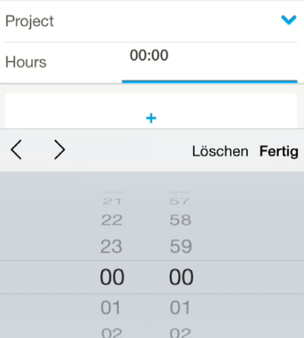
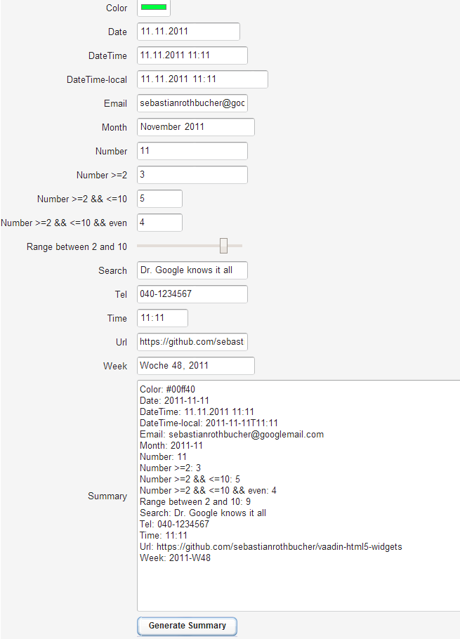

vaadin-html5-widgets
====================

Simple Wrappers for HTML5-inputs for vaadin

Input types like tel or number have long since been useful in the mobile web world as smartphones' virtual keyboards were right the first time. Users had the significant advantage of the right and fully optimized keyboard straight away. 

With the new and cool browsers, this thing has even arrived at the desktop as well: Instead of using custom code (or embedding yet another library), optimized inputs can be provided with nothing but the browser. These range from color chooser to time picker. 

Here's an example of the HTML5 time picker on the iPhone (4S):  <br />

and on Chrome (as of July 20, 2014): <br />

Whether mobile or desktop: to use these cool new features in [vaadin](http://www.vaadin.com) is the aim of this project: it extends the com.vaadin.ui.TextField and changes the input type. For Number and Range it also supports setting vital attributes. This allows you to use the native inputs on the iPhone, on Android, on Chrome, etc. and to provide an optimal experience to your users.

Focus is on a simple solution - i.e. you have getValue() instanceof String, you get/set what the Browser uses and sees. Please note that support for HTML5-inputs varies between browsers and browser versions.

Here's how you use an HTML5-input: 
```java
	ColorField colorField = new ColorField();
	colorField.setCaption("Color");
	layout.addComponent(colorField);
```

Same for Range (displayed as a Slider):
```java
	RangeField rangeField = new RangeField();
	rangeField.setMin(2);
	rangeField.setMax(10);
	rangeField.setCaption("Range between 2 and 10");
	layout.addComponent(rangeField);

```

Download the JAR: 
- <a href="dist/vaadin-html5-widgets-core-1.0.jar">Version 1.0</a> (Release)
- <a href="dist/vaadin-html5-widgets-core-1.1-SNAPSHOT.jar">Version 1.1-SNAPSHOT</a>

There is a sample app available - pls. find the details below.

Feel free to share your insights, thoughts and feedback! - you can do this e.g. by using the Comments function of our Blog (bottom part of the page): 
- [English](http://blog.akquinet.de/2014/09/02/using-html5-inputs-in-vaadin/)
- [German](http://blog-de.akquinet.de/2014/09/02/nutzen-der-html5-inputs-in-vaadin/)


## Some cool input types

With screenshots from the vaadin test app (see below for how to make it work) running in Chrome (as of July 20, 2014): 

Color picker: <br />

Date picker: <br />

Date and timer picker: <br />

Month picker: <br />

Number picker: <br />

Number picker (limited by range and step): <br />

Range (other way of picking a number): <br />

Search (allows clearing): <br />

Time picker: <br />

Week picker: <br />


## Using the elements in your own project

Take the following steps to spice up your vaadin project with the cool HTML5 elements (you can also copy and paste from the sample at vaadin-html5-widgets-test)

- either download the JAR above
- or: Clone / download this project and mvn install at least vaadin-html5-widgets-core
- Include this one as jar into the project you want to use the fields in
- Include this one as jar into the project you compile your widgetset with (might come as transitive dependency)
- Create a custom widgetset (if you don't already have one) and include the Html5 widgets there like this (check out the .gwt.xml of vaadin-html5-widgets-test for one complete way of how to do that): 
```xml
	<inherits name="de.akquinet.engineering.vaadin.html5.Html5Widgets" />
```
- You have to have maven widgetset compilation in place (check out the POM of vaadin-html5-widgets-test for one complete way of how to do that)
- You can now use de.akquinet.engineering.vaadin.html5.widgetset.ColorField and others - all inherit com.vaadin.ui.TextField, so the API will be familiar
- Right now, all return values are java.lang.String, so you can work with what the Browser returns to you
- Above all: Have fun!

In case you want to check out the sample first, take these steps (assuming Eclipse): 
- Clone / download this project and mvn install with Widgetset the parent project vaadin-html5-widgets
- Do an mvn eclipse:eclipse to generate the artifacts for there as well; the two above come out as
```
	mvn install eclipse:eclipse -Pwidgetset
```
- Now you can import as existing projects into eclipse (you'll have vaadin-html5-widget-core and vaadin-html5-widget-test)
- To use the server plugin, go to the properties of vaadin-html5-widget-test and change the Java version in the facet (in "Project Facets") to the one given in the "Java Compiler" section; go to "Deployment assembly" and remove vaadin-html5-widget-core, then re-add it (Add > Project and so on). Finally add target/vaadin-html5-widgets-test-1.0-SNAPSHOT as a folder (also in "Deployment assembly") so the widgetset is available
- To use the server plugin, (furthermore) go to the properties of vaadin-html5-widgets-core change the Java version in the facet (in "Project Facets") to the one given in the "Java Compiler" section
- Deploy to a local tomcat and point your browser to http://localhost:8080/vaadin-html5-widgets-test/
- as ever: Have fun!

BTW: it will look like this: <br />

In short, using the HTML5 components does provide a lot of value - also to vaddin projects: First and foremost on mobile, there is the optimization of input - thus more user-friendliness and more efficiency in working with a vaadin application. Increasingly, the same applies for desktop as well. As HTML5 components are provide out-of-the-box by browsers themselves, there is no additional library required. Furthermore, the vaadin application is as close to the platform's look and feel as it gets.

